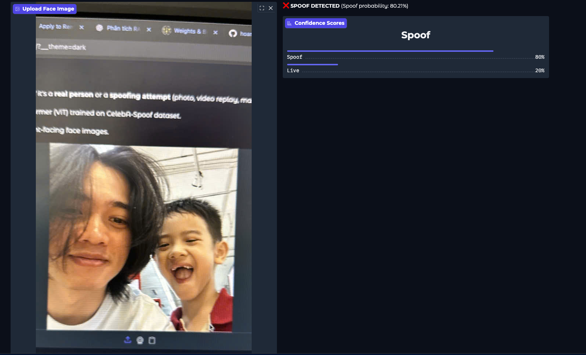
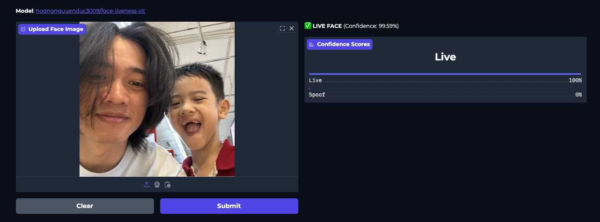
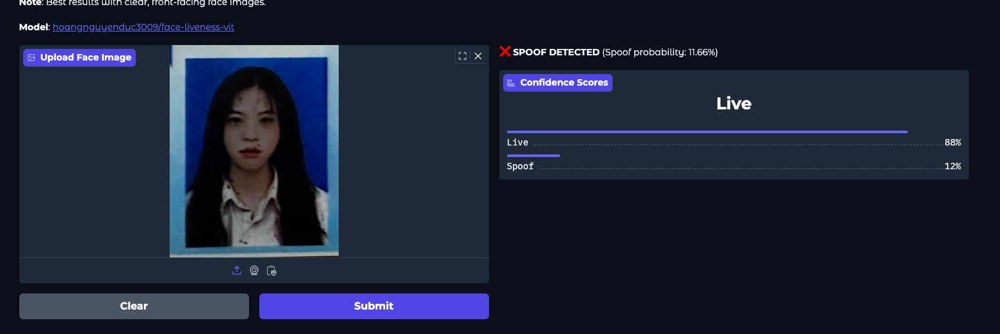

# Face Liveness Detection — Transformer Encoder-Decoder for Anti-Spoofing

This repository provides a **face liveness detection model** designed to defend against **spoofing attacks** (e.g., printed photos, replay videos, or 3D masks).  
It is built on a **Transformer encoder-decoder architecture**, enabling strong temporal and spatial feature modeling for robust face anti-spoofing.


## Overview
The model processes video clips or frame sequences and predicts whether a face is **live** or **spoofed**.  
It leverages a Transformer encoder to learn spatio-temporal embeddings and a decoder/classification head to output binary logits (`live` / `spoof`).

## Results







## Links
- 🚀 **Demo**: [https://huggingface.co/spaces/hoangnguyenduc3009/face-liveness-vit](https://huggingface.co/spaces/hoangnguyenduc3009/face-liveness-vit)
- 🤗 **Model on Hugging Face**: [https://huggingface.co/hoangnguyenduc3009/face-liveness-vit](https://huggingface.co/hoangnguyenduc3009/face-liveness-vit)

## Setup
```bash
python -m venv .venv
source .venv/bin/activate  # (macOS/Linux)
pip install -r requirements.txt
```

## Dataset Preparation
1. Request / download CelebA-Spoof from the official site (academic use only).
2. Extract under `data/CelebA-Spoof/`. Make sure that data/CelebA_Spoof/metas/intra_test/test_label.txt or train_label.txt are available

Tip: Ensure total counts and label balance; you can stratify split with a small Python script.

## Training
```bash
python train.py --config configs/default.yaml --wandb_key {wandb_key}
```
wandb_key is optional
Logs & checkpoints will appear in `logs/` and `checkpoints/` (auto-created).

## Evaluation
```bash
python evaluate.py --config configs/default.yaml --checkpoint checkpoints/best.pt
```

````
